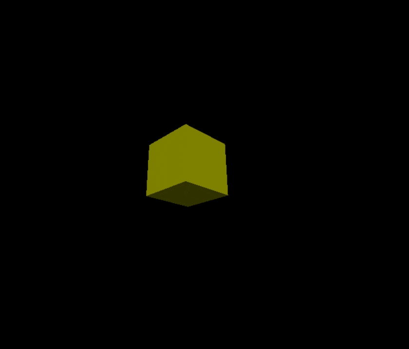

# Rotating Yellow Cube – My First Step with Three.js 🚀

This project marks my **first exploration of 3D development on the web** using **Three.js**.  
While I have experimented with 3D modeling and development before using **C#, Unity, and Blender**, I never really enjoyed those tools.  
Discovering Three.js gave me a new perspective—it felt lighter, more flexible, and closer to what I love: **building for the web**.  

So even though the result here is "just" a rotating yellow cube, for me it represents the start of my journey into **interactive 3D graphics on the browser**.  

  

## ✨ Features  
- A **3D yellow cube** created with `BoxGeometry`  
- Smooth **rotation on the Y-axis**  
- **OrbitControls** for camera zoom and cursor interaction  
- Responsive canvas that adapts to window size  
- Simple **hemisphere lighting** for depth  

## 🛠️ Tech Stack  
- [Three.js](https://threejs.org/) – JavaScript 3D library  
- OrbitControls from `three/examples/jsm/controls/OrbitControls.js`  

---

💡 For me, this project isn’t just a cube—it’s the **foundation of my 3D journey in web development**, combining my web skills with creativity in a way Unity and Blender never clicked for me.  
