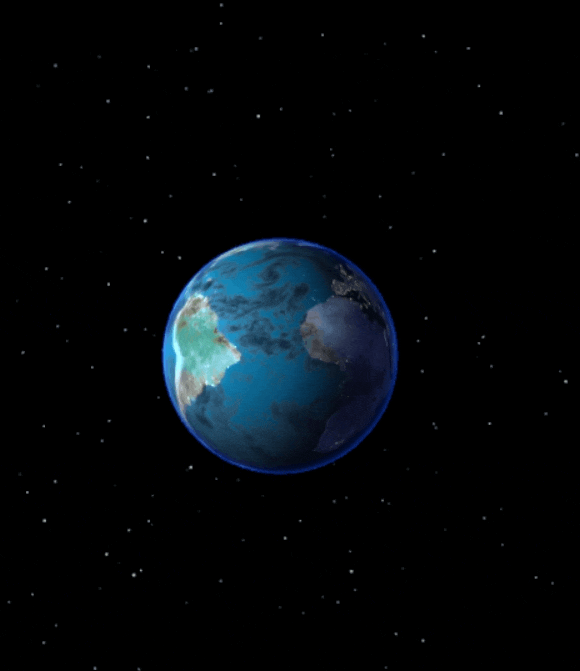

# 🌍 3D Earth Simulation with Three.js  

This project is part of my learning journey with **Three.js**.  
It recreates a **3D interactive Earth** in the browser with rotation, textures, clouds, glow effects, and a starfield background.  

## 🌟 Features  
- **Realistic Earth model** built with an Icosahedron geometry and high-resolution textures.  
- **Multiple textures used**:
  - Color map (surface texture).  
  - Specular map (light reflection).  
  - Bump map (surface relief).  
  - Night lights map (city lights).  
  - Cloud layers with transparency.  
- **Atmospheric glow** effect using a Fresnel shader.  
- **Dynamic starfield** background.  
- **Directional sunlight** to illuminate the Earth.  
- **OrbitControls** for interactive zoom and rotation with the mouse.  
- Smooth **rotation animation** of Earth, clouds, and stars.  
- Responsive resizing for different screen sizes.  

## 🖼️ Preview  
Here's a  static preview of the project:  

  

## 📚 What I Learned  
- How to load and apply different **texture maps** (diffuse, specular, bump, alpha).  
- Using **MeshPhongMaterial** and **MeshStandardMaterial** for realistic effects.  
- Implementing **Fresnel shaders** for atmospheric glow.  
- Adding **transparent cloud layers** with alpha maps.  
- Creating a **starfield** as a background.  
- Managing **lighting and tone mapping** for realism.  
- Making the scene **responsive** to window resizing.  

## 📖 Learning Source  
This project is based on my continuous learning with **Three.js** and experiments inspired by tutorials and practice examples.  
It marks another step forward in my 3D web graphics learning journey.  

 
